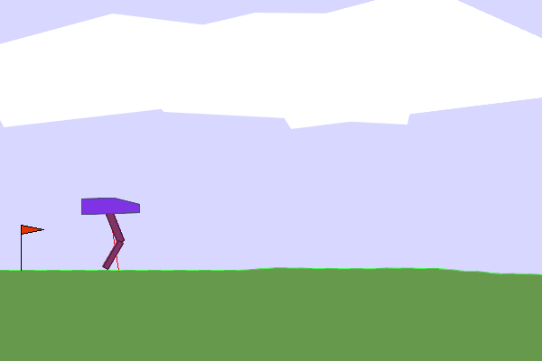

# cma-es-bipedalwalker


This is an implementation of the covariance matrix adaptation evolution strategy (CMA-ES) algorithm, applied to solve the BipedalWalker-v3 environment in [OpenAI Gym](https://github.com/openai/gym). It trained to a neural network policy that achieved an average reward of over 300 in 100 repeated rollouts.



## Requirements
You need to first have `swig` installed in your environment. If you are using conda, you can run in your environment
```bash
conda install swig -y
pip install -r requirements.txt
```

## Description

The CMA-ES algorithm trains a recurrent neural network (RNN) to maximize the reward in the [BipedalWalker](https://www.gymlibrary.ml/environments/box2d/bipedal_walker/) environment. In the environment, a robot walks to the right of the terrain and earns a higher reward if it avoids falling and applies force efficiently. The robot is controlled by an RNN that chooses the actions taken by the robot based on its observations.

The [CMA-ES](https://en.wikipedia.org/wiki/CMA-ES) algorithm is an evolutionary algorithm used to learn the weights of the RNN. As first, the algorithm generates random weights for the RNN with a multivariate normal distribution. It updates the mean of the distribution to be closer to the random policies that perform better. The CMA-ES also adapts the covariance matrix to control the width of the search to avoid being trapped in local minima. The CMA-ES gradually learns to sample weights closer and closer to the global minimum of the cost function. It also avoids calculating derivatives, which is required in backpropagation, the most common method in training neural networks.